# Diagrama de arquitectura PC Mania

```mermaid
flowchart LR
    Cliente["Cliente"]
    Administrador["Administrador"]
    subgraph TIENDA["Frontend tienda - Puerto 5173"]
        Tienda["PC Mania Tienda"]
        TiendaAuth["Inicio de sesión"]
        TiendaCatalogo["Catálogo de productos"]
        TiendaApi["api.ts<br/>GET /api/productos"]
    end
    subgraph ADMIN["Frontend admin - Puerto 5174"]
        Panel["PC Mania Admin"]
        AdminAuth["Inicio de sesión"]
        Inventario["Panel de inventario"]
        AdminApi["api.ts<br/>POST /api/productos"]
    end
    subgraph AUTENTICACION["Autenticación"]
        Cognito["Amazon Cognito"]
        Token["Token de acceso JWT"]
    end
    subgraph BACKEND["Backend - Puerto 8080"]
        Spring["Spring Boot"]
        Cors["Configuración CORS"]
        Controller["ProductoController<br/>/api/productos"]
        Validation["Validación de datos"]
        Service["ProductoService"]
        Storage["ConcurrentHashMap<br/>Inventario en memoria"]
        Errors["GlobalExceptionHandler"]
    end
    Cliente --> Tienda
    Administrador --> Panel
    Tienda --> TiendaAuth
    TiendaAuth --> Cognito
    Cognito --> Token
    Token --> TiendaCatalogo
    TiendaCatalogo --> TiendaApi
    Panel --> AdminAuth
    AdminAuth --> Cognito
    Token --> Inventario
    Inventario --> AdminApi
    TiendaApi -->|"GET /api/productos"| Spring
    AdminApi -->|"POST /api/productos"| Spring
    Spring --> Cors
    Cors --> Controller
    Controller --> Validation
    Validation -->|"Datos válidos"| Service
    Validation -->|"Datos inválidos"| Errors
    Controller -->|"Producto no encontrado"| Errors
    Service --> Storage
    classDef actor fill:#fce4ec,stroke:#c2185b,stroke-width:2px,color:#000
    classDef frontend fill:#e3f2fd,stroke:#1565c0,stroke-width:2px,color:#000
    classDef auth fill:#fff3cd,stroke:#e0a000,stroke-width:2px,color:#000
    classDef backend fill:#e8f5e9,stroke:#2e7d32,stroke-width:2px,color:#000
    classDef error fill:#ffebee,stroke:#c62828,stroke-width:2px,color:#000
    class Cliente,Administrador actor
    class Tienda,Panel,TiendaAuth,AdminAuth,TiendaCatalogo,Inventario,TiendaApi,AdminApi frontend
    class Cognito,Token auth
    class Spring,Cors,Controller,Validation,Service,Storage backend
    class Errors error
```

## Componentes

- **Tienda:** consulta el catálogo mediante `GET /api/productos`.
- **Panel admin:** agrega productos mediante `POST /api/productos`.
- **Amazon Cognito:** gestiona el inicio de sesión y entrega el token de acceso.
- **Backend Spring Boot:** recibe las solicitudes y ejecuta el CRUD de productos.
- **Inventario:** actualmente se almacena en memoria y se pierde al reiniciar.

> Nota: el backend actual permite enviar el token desde los frontends, pero todavía no implementa un filtro propio para validar JWT de Cognito.
