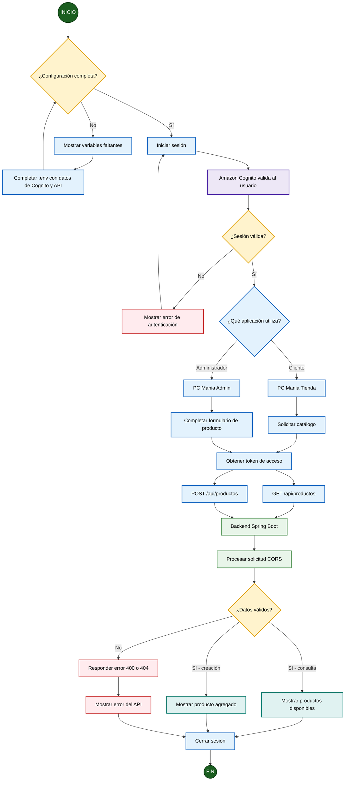

# Diagrama de flujo PC Mania

## Flujo resumido

1. Se comprueba la configuración del frontend.
2. El usuario inicia sesión mediante Amazon Cognito.
3. La tienda consulta productos o el administrador completa el formulario.
4. Se envía la solicitud al backend con el token de acceso.
5. Spring Boot valida los datos y procesa la operación.
6. Se muestra el resultado o el mensaje de error.
7. El usuario cierra sesión.
